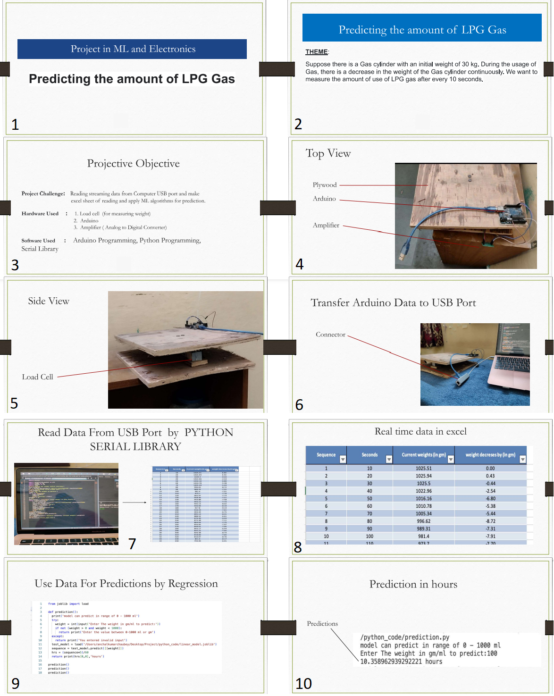

# LDI Pro System

## [Abstract](https://github.com/medipanshu/LDiProSystem/blob/main/AbstractAndReport/project%20abstract.pdf)

The main aims of the project are as follows:
- To measure the weekly usage of LPG in a household.
- On the basis of daily collected data, the system will predict the date on which the LPG cylinder is going to be empty.
- Once the system predicts the date, it will book the new LPG cylinder automatically with the user's permission.
- Once trained, the system will know the usage time of LPG, and when the cylinder is running low, it will alert the user by an alarm.
- It will detect gas leaks, stop the flow of gas in the pipeline, and alert the user.

### Need of the Project:

Around 62 people die every day due to fire accidents in Indian households. This system is designed to reduce these numbers. It will save people's lives as well as save precious natural resources by reducing gas wastage.
It prevents the LPG cylinder from blast.
It has an automatic LPG cylinder booking facility.

# Progress of project
## Current Work (Implemented)
1. **Hardware**
2. **Gas Cylinder Weight Monitoring System**
## Features to be implemented 
1. **Booking the new LPG cylinder automatically**
2. **Detect gas leaks**
3. **Alert the user**

---

# Current Work (Implemented)

## Gas Cylinder Weight Monitoring System

### Overview
This project focuses on monitoring the usage of LPG gas in a cylinder by utilizing a load cell interfaced with an Arduino. The system records real-time weight data, analyzes consumption patterns, and provides insights into the rate of gas consumption at different times of the day.

### Components and Dependencies
1. **Arduino Setup:**
    - Data is read from the load cell (AtoD converter) using the Arduino.
    - The required library for interfacing with the load cell is 'HX711_ADC.' If not already present in your Arduino IDE, you can download it from the 'HX711_ADC' folder.

2. **Data Transmission:**
    - The Arduino sends the load cell data to the USB port.

3. **Python Integration:**
    - Stream data is read from the serial (USB port) using the Python Serial library.

### Demo Data
- 'Final_data1.xlsx' provides a small demonstration of reading data at 10-second intervals from a 1000g water container.
- Note: Due to potential hardware variations, there might be a margin of error of ±50.

### Project Description
The system is designed to monitor the consumption of LPG gas in a cylinder with an initial weight of 30 kg. As gas is used, there is a continuous decrease in weight. The project aims to measure gas consumption every 10 seconds, allowing for a detailed analysis of consumption patterns throughout the day, such as during breakfast, lunch, and dinner.

### Data Analysis and Future Enhancements
1. **Usage Patterns:**
    - Analyzing data collected over 15 minutes (90 data points) to understand usage patterns.
  
2. **Linear Regression Model:**
    - Predicting the time to finish a specific amount of gas using a linear regression model.
  
3. **Future Enhancements:**
    - Ongoing efforts to enhance project reliability through improved data analysis.
    - Exploring advanced data analysis techniques for more accurate results.

### Notes
- It's essential to consider hardware variations that may introduce a margin of error in the weight measurements (+50 or -50).
- Continuous improvements and refinements are part of our ongoing project development.

We encourage contributions and feedback to make this Gas Cylinder Weight Monitoring System more robust and insightful.
